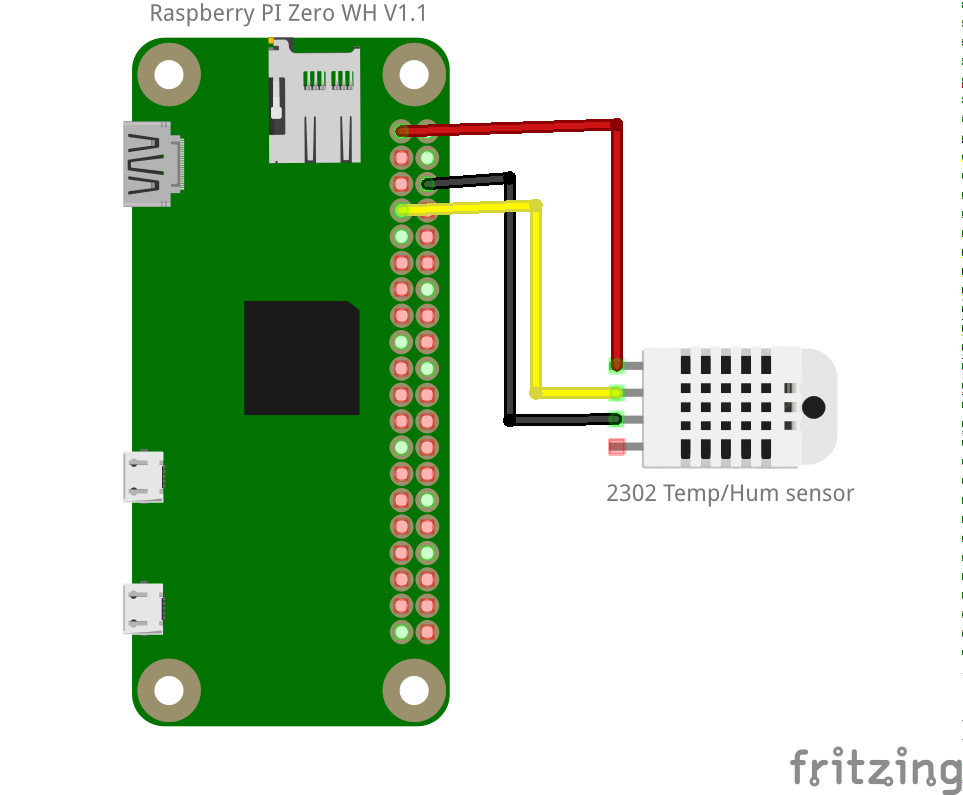

# rpizwh-am2302

In this project, we will setup 3 Raspberry PI Zero HW with AM2302 temperature and humidity sensor. The goal is to place at strategic places in my apartment each of the 3 Raspberry PI, to measure every 30 seconds a new value in order to see the evolution of the temperature and humidity over time.

## Connection schematics 
<p align="middle" ></p>

```
AM2302        ▶ Raspberry PI Zero WH
------------------------------------
GND  (black)  ▶ Pin 6 
VCC  (red)    ▶ Pin 1 (3.3V)
DATA (yellow) ▶ Pin 7 (GPIO 4)
```

## AM2302 sensor
The AM2302 is a wired version of the DHT22, in a large plastic body. It is a basic, low-cost digital temperature and humidity sensor. It uses a capacitive humidity sensor and a thermistor to measure the surrounding air and spits out a digital signal on the data pin (no analog input pins needed). It's fairly simple to use but requires careful timing to grab data. The only real downside of this sensor is you can only get new data from it once every 2 seconds, so when using our library, sensor readings can be up to 2 seconds old.

### Install
To read the AM2302 sensor we use "Adafruit_DHT" python library.
```
[pi@rpi] sudo apt-get update
[pi@rpi] sudo apt-get install python3-pip
[pi@rpi] sudo python3 -m pip install --upgrade pip setuptools wheel
[pi@rpi] sudo pip3 install Adafruit_DHT
```
### Test
Here an example to test if the sensor is working:

https://github.com/adafruit/Adafruit_Python_DHT/blob/master/examples/AdafruitDHT.py

```
[pi@rpi] git clone https://github.com/adafruit/Adafruit_Python_DHT/blob/master/examples/AdafruitDHT.py
[pi@rpi] cd Adafruit_Python_DHT/examples
[pi@rpi] python3 AdafruitDHT.py 2302 4
Temp=22.0*  Humidity=51.1%
```

# Ref
- [AM2302 (WIRED DHT22) TEMPERATURE-HUMIDITY SENSOR](https://www.adafruit.com/product/393)
- [AM2302 Temp/Humidity Sensor](https://thepihut.com/blogs/raspberry-pi-tutorials/am2302-temp-humidity-sensor)
- [Tutorial DHT22, DHT11 und AM2302 Temperatursensor](https://buyzero.de/blogs/news/tutorial-dht22-dht11-und-am2302-temperatursensor-feuchtigkeitsensor-am-raspberry-pi-anschliessen-und-ansteuern)